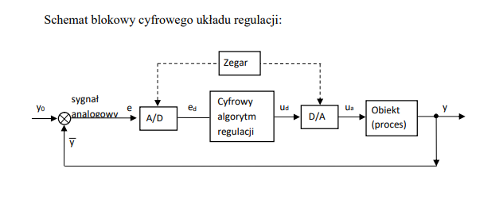

# Dyskretyzacja

Przetwarzanie funkcji ciąglych na ich dyskretne (skwanfowane) odpowiedniki. Jej celem jest przygotowanie modelu numerycznego, który można zaimplementować jako program komputerowy.

Metody przeprowadzania dyskretyzacji:

  - ZOH (Zero-Order Hold),
  - Tustina.

# Metoda ZOH

## Zastosowanie

Stosowany podczas przetwarzania sygnału cyfrowego na analogowy (sygnału komputerowego na prądowy).

Może być użyta do zamiany sygnału ciągłego na dyskretny oraz odwrotnie, dyskretnego na ciągły.

## Działanie

Metoda, co powien czas (czas próbkowania) pobiera wartość sygnału ciągłego w danym momencie (próbkę). Nastepnie, metoda podtrzymuje wartość tej próbki aż do następnego następnego pobrania próbki (próbkowania).

## Ekstrapolator zerowego rzędu

Impulsator idealny (coś, co wysła impuls) razem z elementem o jakiejś transmitancji (element formujący) nazywa się ekstrapolator zerowwego rzędu (ZOH). Taki blok dokonuje rekonstrukcji sygnału przez podtrzymanie wartości każdej z próbek przez jeden okres próbkowania. W praktyce, ten blok dokonuje zamiany sygnału ciągłego na dyskretny.

# Metoda Tustina

Jest to przekształcenie transmitancji Laplace'a na transmitancję stanu przestrzeni, która działa przez podstawienie.

# Układ automatycznej regulacji

A/D to konwerter sygnału analogowego na cyfrowy
D/A to konwerter sygnału cyfrowego na analogowy

Sygnał analogowy e jest zamieniany na sygnał cyfrowy ed, następnie cyfrowy algorytm regulacji wykonuje swoje operacje i wytwarza sygnał cyfrowy ud, który z kolei jest tłumaczony na sygnał analogowy ua, który może sterowac obiektem (procesem).

## Próbkowanie

Przetworzenie sygnału ciągłego na dyskretny za pomocą wartości pobieranych z sygnału ciągłego. W chwili próbkowania, wartości sygnału dyskretnego są równe wartościom sygnału ciągłego (ale tylko w tych chwilach). Odstepny między kolejnymi pobraniami próbek są jednakowe i noszą nazwę okresu próbkowania.

## Kwantowanie

Przyporządkowanie jednakowych wartości sygnału między dwoma różnymi chwilami.

## Kodowanie

Zamiana sygnału wejściowego na sygnał użyteczny dla komputera (dwójkowy).

## Proces regulacji w warunkach przemysłowych

W warunkach przemysłowych sygnały wymagające odpowiedzi to z reguły sygnały analogowe (temperatura, ciśnienie, itd.). Aby dokonać regulacji, należy przetworzyć je na sygnały cyfrowe. W tym celu sygnał analogowy jest próbkowany, następnie kwantowany, a wynik zostaje zakodowany.